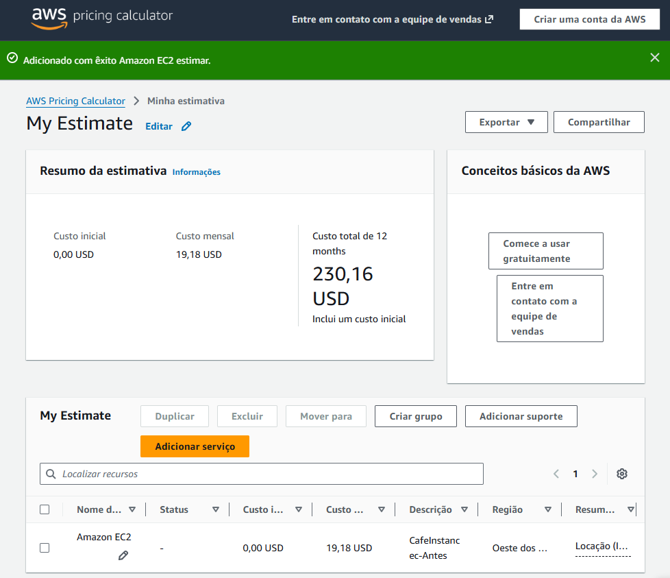
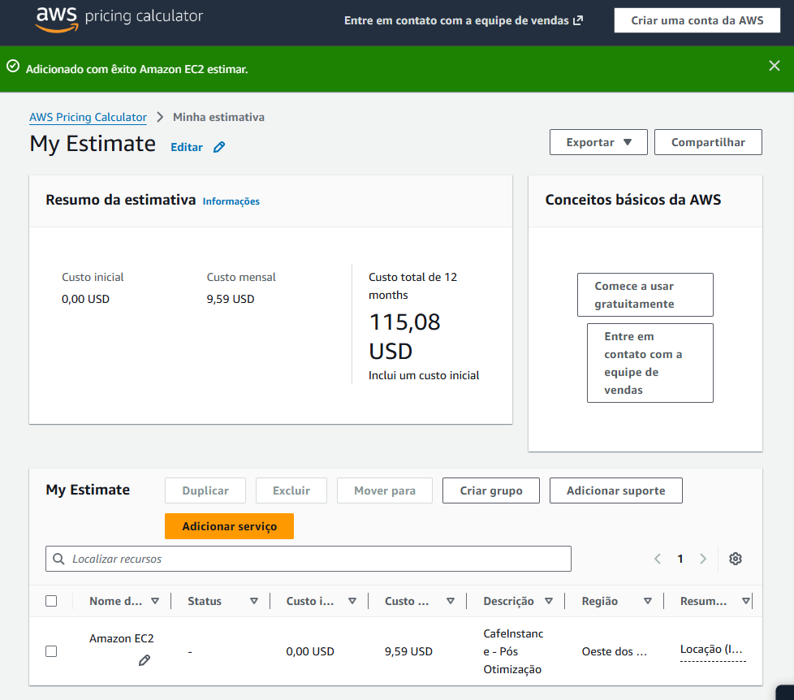

# Lab 189 — Otimização de custos: right-sizing de uma instância EC2

Documentação da atividade **Otimizar a utilização**, realizada durante o programa **Desenvolvimento Web com Cloud AWS** (Generation Brasil + AWS re/Start).

Diferente da maioria dos labs anteriores, o objetivo aqui não era subir infraestrutura nova — era **reduzir custo** de uma infraestrutura que já existia e que tinha sobrado de uma etapa anterior (a migração de um banco de dados local para o Amazon RDS).

---

## Caso de negócio

O cenário é o aplicativo web de uma cafeteria fictícia. Em uma atividade anterior, o banco de dados local (MariaDB) da instância EC2 da cafeteria havia sido migrado para o Amazon RDS. Só que, depois da migração, dois problemas continuaram:

- O MariaDB desativado ainda estava instalado na instância, ocupando espaço de armazenamento à toa.
- A instância continuava rodando em um tipo (`t3.small`) dimensionado para uma carga de trabalho que não existia mais, já que o processamento do banco tinha saído dali.

A tarefa era identificar e eliminar esse desperdício.

---

## Arquitetura: antes e depois

<p align="center">
  
</p>

| | Antes da otimização | Depois da otimização |
|---|---|---|
| Instância EC2 | `t3.small` | `t3.micro` |
| Banco de dados local | MariaDB desativado, ainda instalado | Removido |
| Volume EBS (gp2) | 40 GB | 20 GB |
| Banco de dados ativo | Amazon RDS (MariaDB) | Amazon RDS (MariaDB) |

A topologia de rede (VPC, sub-rede pública, CafeSecurityGroup, Host da CLI e instância RDS) permanece a mesma nos dois cenários — a única mudança é o tamanho da instância EC2 e a remoção do banco de dados local desativado.

---

## O que foi feito

### 1. Remoção do banco de dados local

Via SSH na instância da cafeteria, parei e desinstalei o MariaDB que não tinha mais função ali:

```bash
sudo systemctl stop mariadb
sudo yum -y remove mariadb-server
```

### 2. Redimensionamento da instância via AWS CLI

A partir de uma instância separada (CLI Host), usei a AWS CLI para localizar o ID da instância, pará-la, alterar o tipo de `t3.small` para `t3.micro` e reiniciá-la:

```bash
aws ec2 describe-instances \
  --filters "Name=tag:Name,Values=CafeInstance" \
  --query "Reservations[*].Instances[*].InstanceId"

aws ec2 stop-instances --instance-ids <CafeInstance-ID>

aws ec2 modify-instance-attribute \
  --instance-id <CafeInstance-ID> \
  --instance-type "{\"Value\": \"t3.micro\"}"

aws ec2 start-instances --instance-ids <CafeInstance-ID>
```

Depois de reiniciada, a instância recebe um novo DNS/IP público, então validei o site novamente pela nova URL para confirmar que continuava funcionando normalmente após o downsizing.

### 3. Estimativa de custo com a AWS Pricing Calculator

Usei a [AWS Pricing Calculator](https://calculator.aws) para comparar o custo estimado da instância EC2 antes e depois da otimização, mantendo a mesma região e o restante da configuração.

| | Custo mensal (EC2) | Custo total estimado em 12 meses |
|---|---|---|
| Antes da otimização (t3.small) | 19,18 USD | 230,16 USD |
| Depois da otimização (t3.micro) | 9,59 USD | 115,08 USD |
| **Economia (somente EC2)** | **9,59 USD/mês** | **115,08 USD/ano** |

> Os valores acima refletem apenas o componente Amazon EC2 da estimativa (conforme os prints exportados da calculadora). A estimativa completa do cenário também inclui o custo do Amazon RDS, que não muda entre os dois cenários, já que o tipo de instância do banco não foi alterado nesta atividade.

<p align="center">
  
</p>

<p align="center">
  
</p>

---

## Por que isso importa

Migrar para a nuvem resolve um problema, mas cria outro: é muito fácil deixar recursos superdimensionados ou obsoletos continuarem rodando, gerando custo sem gerar valor. Esse lab reforçou uma prática básica de FinOps — **right-sizing**: revisar periodicamente se o recurso provisionado ainda corresponde à carga de trabalho real, e ajustar (ou remover) o que não faz mais sentido.

Isoladamente, a economia parece pequena. Multiplicada por dezenas ou centenas de instâncias em um ambiente real, é exatamente esse tipo de ajuste que separa uma operação em nuvem com custo sob controle de uma com desperdício acumulado.

---

## Tecnologias e conceitos aplicados

- Amazon EC2 (redimensionamento de tipo de instância)
- Amazon EBS (redução de volume de armazenamento)
- AWS CLI (`describe-instances`, `stop-instances`, `modify-instance-attribute`, `start-instances`)
- AWS Pricing Calculator (estimativa e comparação de custos)
- Amazon RDS (contexto: banco já migrado em atividade anterior)
- Conceitos de FinOps / right-sizing

---

## Contexto do programa

Atividade realizada como parte do programa **AWS re/Start / Desenvolvimento Web com Cloud AWS**, oferecido pela [Generation Brasil](https://www.linkedin.com/company/generationbrasil/).
